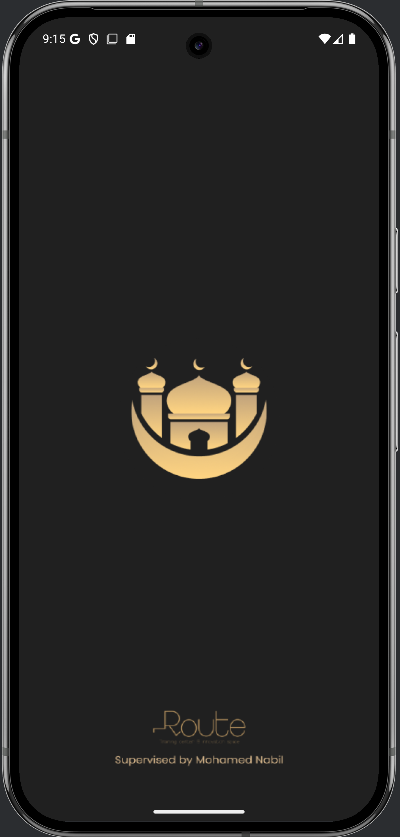
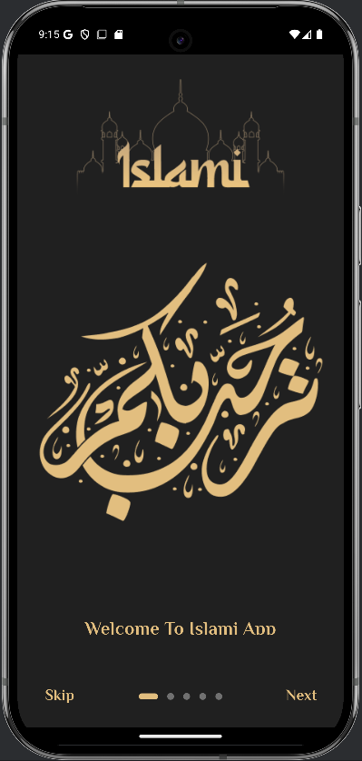
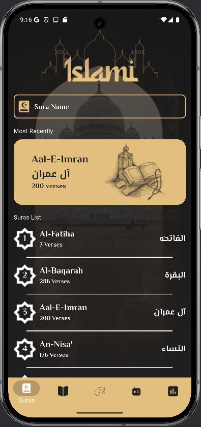
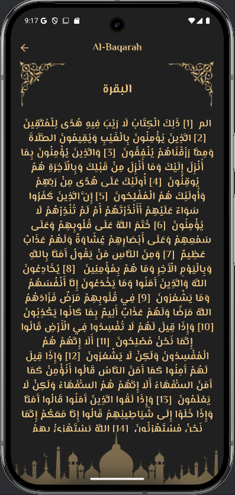
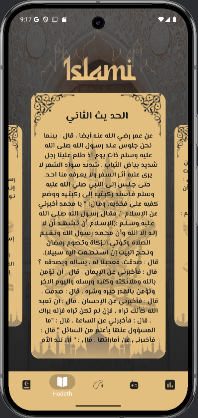
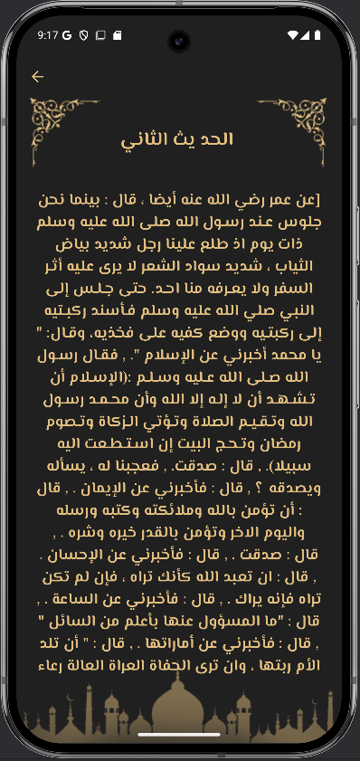
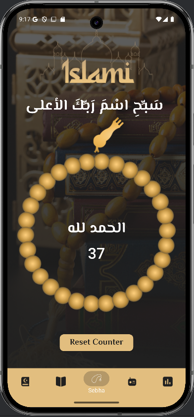
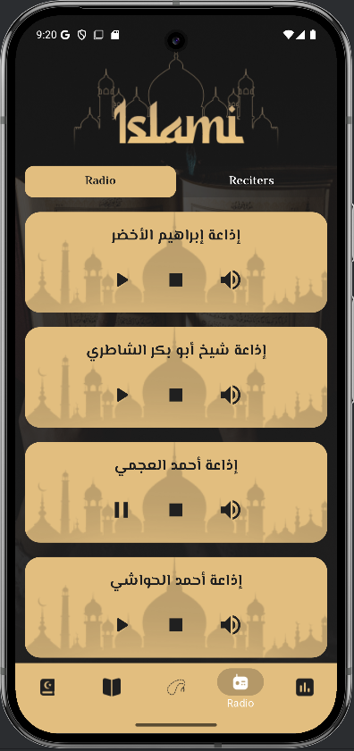
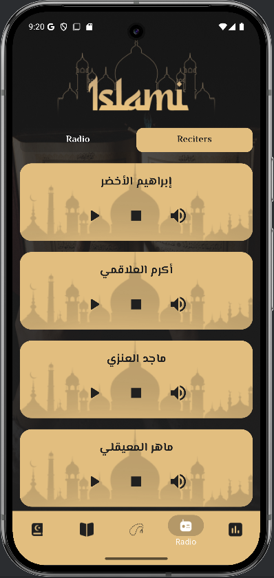

# 📱 Islami App

## Project Description:
Islami" is a user-friendly Flutter application designed to enhance the Islamic experience for Muslims. The app consists of five main sections:

Surah Selection & Search – Users can browse and search for specific Surahs to read from the Quran.
Hadith Reading – A dedicated page to explore and read authentic Hadiths.
Tasbih (Prayer Beads) – A digital counter to help users keep track of their Tasbih recitations.
Islamic Radio – Provides access to live streaming of Islamic lectures and recitations.
Prayer Times – Displays accurate prayer timings based on the user's location.
With a simple and intuitive interface, "Islami" ensures an enriching spiritual experience for users looking to engage with Islamic content daily.

## Screenshots

#App Intro

  
  

# App Home
There is a Bottom app bar with 5 tabs (Home (for Quran), Hadeeth, Sebha, Radio, Time (for prayers time))

  
  
  
  
  
  
  

